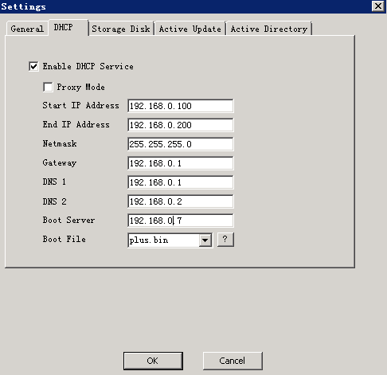

# 服务端安装

###获取安装包

请致电 021-36520519 获取最新安装包。

###安装服务器

使用安装程序，使用默认设置进行安装

###配置服务器

配置服务器前的准备：

* 将服务器IP设置为固定
* 在D盘上创建d:\Data\Base   d:\Data\User  d:\Data\Temp 这三个目录
---

###服务器环境初始化

####设置DHCP服务器与全局环境

1. 在桌面上运行 “OSV Plus控制台” 快捷方式，
2. 登录框中输入以下信息进行登录：  **IP：127.0.0.1**    ** 端口：7000**     **密码：123456**
3. 选择工具栏-设置-设置选项卡
4. 在全局选项卡中开启“允许新计算机加入”
5. 在dhcp选项卡中开启DHCP服务器（不要勾选代理模式）
6. 输入起始IP，结束IP，网关，掩码信息，在“启动服务器中”填入本机IP
7. 配置完成后，点击确定

####添加I/O服务器

                                   
                                   
                                   
                                 
                        
                             

                         
               
                               
                             
                            
                            
                           
                             
                             
                             

                                           
                                           
                                           
 

