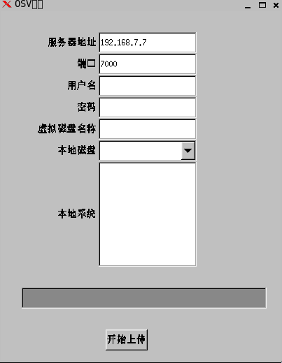
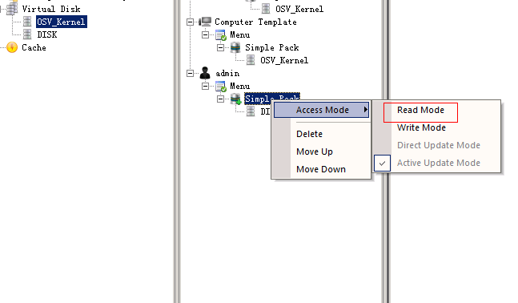

# 使用上传工具制作
###进行本次操作时准备工作
* 服务器软件已安装
* 服务器软件已初始化
* 服务器端允许新计算机加入并打开
* 服务器已正确生成计算机
* 服务器端DHCP功能已打开，并已正确配置
* 服务器和模板终端所处同一局域网（如无条件实现，请参考“DHCP 中继器”的使用）

###1，安装客户端软件
1. 在已有操作系统中，安装客户端软件
2. 安装完毕后，关闭计算机

### 2，配置服务器环境
一，新建虚拟磁盘：    
    打开控制台，找到“虚拟磁盘”，选择右键--新建磁盘--虚拟磁盘，输入 磁盘名称，磁盘大小，和存储位置
  

 1，新建虚拟磁盘

2，设置虚拟磁盘名称和容量大小（容量必须大于本地磁盘 如本地磁盘为500G，此处应为 5120000 ）

3，在ADMIN帐户下，新建一个启动菜单“Menu”

4, 新建一个菜单名称为“Menu”的启动菜单

5，在Menu下新建一个简单包

6，将新建的虚拟磁盘拉到 “Menu”的简单包下

7，设置启动菜单为“活动更新模式”

#开始进行上传
#####1，准备客户端环境
* 在模板终端上安装操作系统
* 安装业务软件和进行系统相关设置，优化
* 在模板终端上安装客户端软件

    
#####2，进行上传
    
1.  将模板终端的启动设备选择 “网络启动”

2.  选择要加入的计算机名称

3.  进入BOOTLoader主界面

4.  按下键盘上的“F3”键，进入上传系统界面

5.  上传完成后，按下 Ctrl + Alt + Del 组合键重启计算机

6.  操作“Menu”菜单下的简单包，进行确认更新操作

###进行上传

* 客户端选择使用PXE网络启动计算机
* 客户端会自动进入OSV_Kernel模式
* 选择上传工具

* 服务器IP：请输入服务器的IP
* 端口：7000 默认使用7000端口
* 用户名：登录控制台的用户名
* 密码：登录控制台的密码
* 虚拟磁盘名称：此处填写任意数字，此项暂不生效
* 本地磁盘：请选择要上传的本地磁盘
* 本地系统：请勾选本地系统所在的分区
* 开始上传：选择好后，开始进行上传

>选择开始上传后，进行系统上传

###上传完成

* 上传完成后，关闭上传终端
* 回到控制台，将admin下的简单包，切换回还原模式

> 此时上传工作完成，镜像已制作完毕

   
   
   
   
 
   
   

    
    
        
        
   
   
   
     
     

    
   

