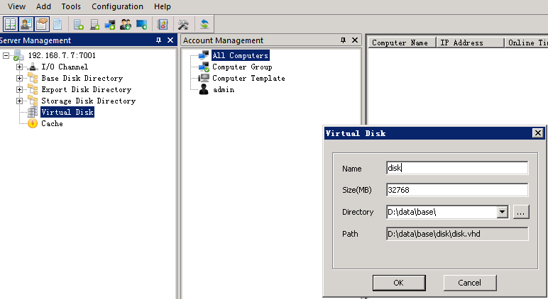
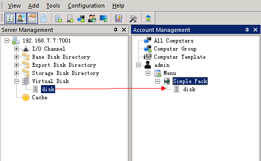

# 使用上传工具制作
###进行本次操作时准备工作
* 服务器软件已安装
* 服务器软件已测试化
* 服务器端允许新计算机加入并打开
* 服务器端DHCP功能已打开，并已正确配置
* 已制作好模板计算机
* 服务端已正确添加OSV_Kernel.vhd镜像

###1，安装客户端软件
1. 在已有操作系统中，安装客户端软件
2. 安装完毕后，关闭计算机

### 2，配置服务器环境
一，新建虚拟磁盘：    
    打开控制台，找到“虚拟磁盘”，选择右键--新建磁盘--虚拟磁盘，输入 磁盘名称，磁盘大小，和存储位置。   
    
    
    
    
       
     
二，配置上传磁盘  
* 找到计算机帐户选项卡，在admin帐户下，新建一个菜单“Update”
* 在update菜单下新建一个“简单包”
* 将第一步新建的虚拟磁盘，拖拉到刚刚新建的简包下
   
   
   
   
   
   三，配置上传环境
   
   * 添加官方提供的Linux_Kernel.vhd镜像

   
   
   
   
 
   
   

    
    
        
        
   
   
   
     
     

    
   

