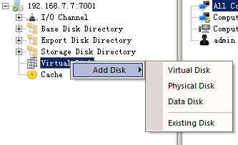

# 使用上传工具制作
###1，安装客户端软件
1. 在已有操作系统中，安装客户端软件
2. 安装完毕后，关闭计算机

### 2，配置服务器环境
一，新建虚拟磁盘：    
    打开控制台，找到“虚拟磁盘”，选择右键--新建磁盘--虚拟磁盘，输入 磁盘名称，磁盘大小，和存储位置。   
      
      
      
        
        
        
    
    
        
   
   
   
     
     

    
   

