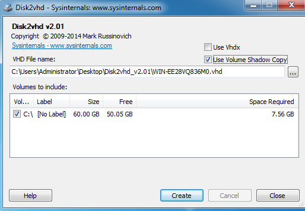
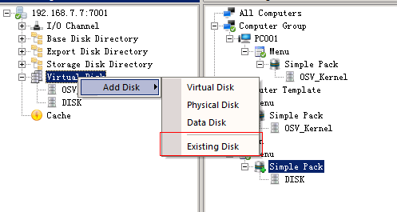
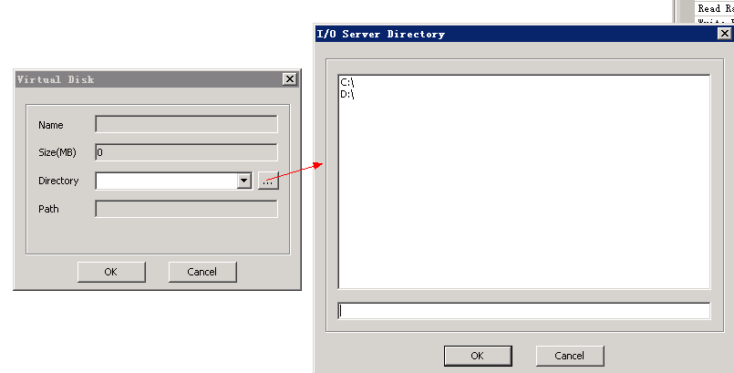

# 使用V2P工具制作

######准备工作：
* 在终端上安装操作系统
* 在终端上安装客户端软件
* [下载DISK2VHD工具](http://vpn.os-v.com:82/%E5%B7%A5%E5%85%B7/disk2vhd.zip)

######操作方法
* 终端上启动Disk2VHD工具
* 取消"Use VhdX"选项
* 勾选要制作的分区
* 选择Create进行创建

> 使用Disk2VHD进行制作时，请取消 Use VHDX 选项  
> 可以同时将本地的多个分区打包成VHD镜像  

   
######将制作好的镜像添加进服务器  

* 将制作完成的镜像文件，拷贝到服务器
* 在服务器上，新建一个与镜像文件同名的目录
* 将镜像文件移动至新建的同名目录中
* 在服务器控制台上，找到虚拟磁盘
* 右键，点击添加-已存在的磁盘
* 点击"..."进行浏览添加

   
     
     
**导入镜像方法：图1**

**导入镜像方法：图2**

