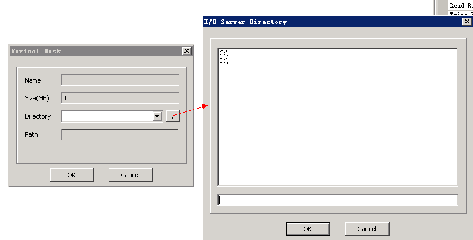

# 使用virtualbox制作
###准备工作
* 下载，安装virtualbox软件  [下载地址](http://vpn.os-v.com:82/tools/VirtualBox-Win.exe)
* 新建虚拟机，进入虚拟机新建向导
* 输入虚拟机名称，并选择虚拟机内存大小
* 进入新建磁盘选项卡，选择新建
* 磁盘类型选择为VHD  

   
 
 
 * 硬盘大小等安装实际需求填写
 * 在virtualbox的虚拟机中安装操作系统和所使用软件
 * 在virtualbox中安装客户端软件
 * 在virtualbox中导入磁盘驱动，磁盘驱动导入和驱动下载请查看“如何导入磁盘驱动”  [驱动下载](http://vpn.os-v.com:82/tools/Drv.WinXP.rar)
 * 所有操作完成后，关闭虚拟机
 * 进入virtualbox的虚拟机保存目录，将其虚拟机中的VHD镜像文件复制到服务器
 * 在服务器导入virtualbox制作完成的镜像文件

######将制作好的镜像添加进服务器  

* 将制作完成的镜像文件，拷贝到服务器
* 在服务器上，新建一个与镜像文件同名的目录
* 将镜像文件移动至新建的同名目录中
* 在服务器控制台上，找到虚拟磁盘
* 右键，点击添加-已存在的磁盘
* 点击"..."进行浏览添加

   
     
     
**导入镜像方法：图1**

**导入镜像方法：图2**

 

