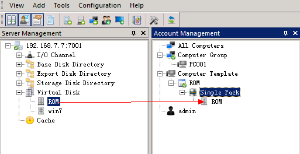
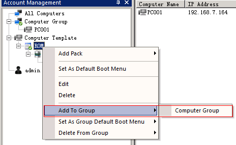
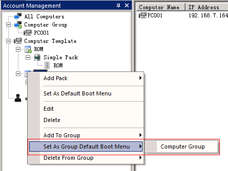
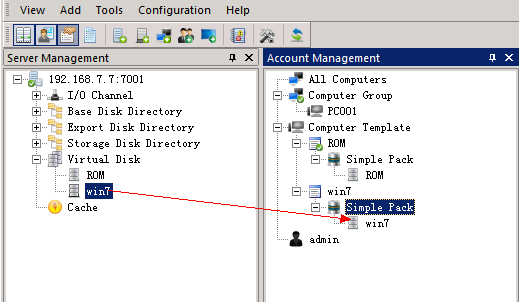

# 下发桌面

###下发桌面前的准备工作
* 终端计算机已添加进服务器
* 终端镜像已制作完成
* 已正常初始化服务器

###分配桌面

#####添加桌面下发工具 “ROM” （控制台已添加略过此步）
* 在计算机模板上，点击鼠标右键，新建启动菜单 "ROM"
* 在"ROM"启动菜单下，点击鼠标右键，新建一个简单包
* 将"ROM"虚拟磁盘拖进该简单包下

  
  **将 “ROM” 启动菜单发送至终端**
* 在“ROM”启动菜单上，点击右键-添加到分组-计算机分组

* 在“ROM”启动菜单上，点击右键-设置分组默认启动菜单-计算机分组

> ROM到这里就分配完成了，ROM的作用：在没有操作系统时，提供引导下发第一个操作系统时使用

##### 分配桌面

* 在计算机模板上，点击鼠标右键-新建启动菜单"win7"
* 在"win7"启动菜单下，新建一个简单包
* 将"win7"虚拟磁盘拖进该简单包下

