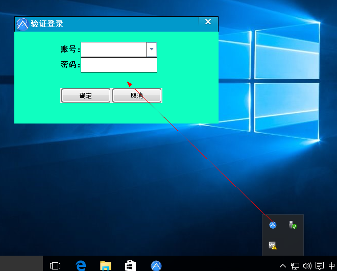
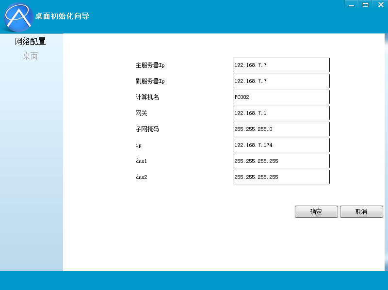
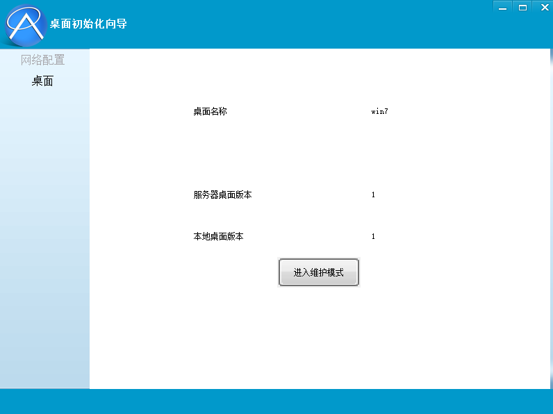

# 更新桌面

###下发桌面前的准备工作

* 桌面已下发完成

* 桌面版本号与服务器一致

> 桌面更新专业术语为“桌面维护”模式，维护桌面即更新桌面

###开始维护桌面

#####进入桌面维护模式的方法：

1，在终端，双击桌面右下角OSV图标，输入密码后进入桌面维护模式

2，输入控制台用户名和密码进入管理 默认用户名密码为:admin 123456

3，在网络配置处，直接选择确定

4，开启使用桌面维护模式

5，此时桌面将自动重启进入桌面维护模式

6，桌面维护结束后，选择“关闭并保存”选项。

7，计算机将重新启动，并自动上传所作操作至服务器

8，其他计算机开机后，将会自动下载此次更新操作

